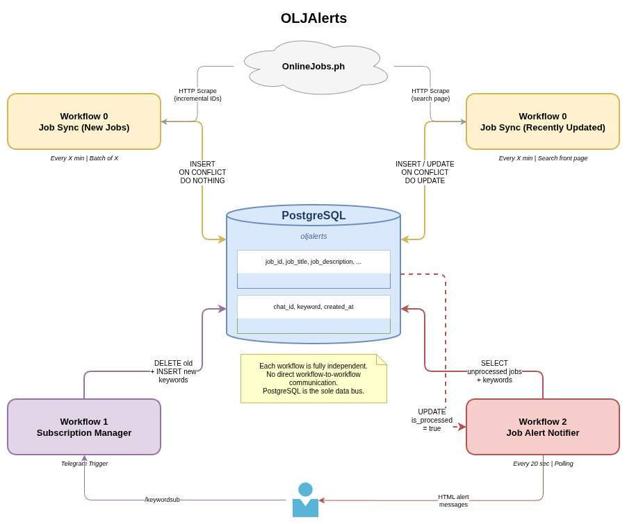

# OLJAlerts 🚨

Automated job alerts for OnlineJobs.ph — get notified on Telegram when jobs matching your keywords are posted.

**Perfect for:** Job hunters who want instant notifications without constantly checking job boards.

**Get Started:** https://t.me/OLJAlertBot

---

## Architecture



---

## What It Does

1. **Scrapes** OnlineJobs.ph for new and recently updated job postings
2. **Stores** jobs in a database
3. **Lets you** subscribe to keywords via Telegram bot (https://t.me/OLJAlertBot)
4. **Sends** you a Telegram message when a matching job is posted
5. **Auto-cleans** subscriptions when users block the bot

---

## What You Need

- **Linux server** (self-hosted)
- **n8n** (automation tool)
- **PostgreSQL** (database)
- **Supabase** (logging/analytics)
- **Telegram Bot Token** (from @BotFather)
- **Basic tech skills** (you got this!)

---

## How It Works

```
OnlineJobs.ph → n8n → PostgreSQL → n8n → Telegram → You
   (new/updated jobs) (scrape)   (store)    (match)   (alert)
```

Think of it as a pipeline:
- **Stage 1:** Scrapes job listings automatically (new jobs every 8 min, recently updated every 15 min)
- **Stage 2:** Stores everything in a database
- **Stage 3:** Matches jobs against your keywords (every 20 seconds)
- **Stage 4:** Sends you alerts on Telegram

---

## Project Status

**✅ Complete:**
- Job Sync (Workflow 0) — Scrapes new job postings every 8 minutes
- Job Sync Recently Updated (Workflow 0) — Scrapes recently updated jobs with old job_ids every 15 minutes
- Subscription Manager (Workflow 1) — Manage keywords, unsubscribe, view stats, admin commands, and help via Telegram
- Alert Notifier (Workflow 2 + Subworkflow) — Sends notifications when jobs match, auto-cleans blocked users

---

## Telegram Bot Commands

| Command | Description |
|---|---|
| `/keywordsub keyword1, keyword2, keyword3` | Subscribe to keywords (max 3, replaces existing) |
| `/unsub` | Unsubscribe from all keywords |
| `/stats` | View system stats (admin only) |
| `/admin keyword1, keyword2, ...` | Set keywords with no limit (admin only) |
| Any other message | Shows help with example commands |

**Start using the bot:** https://t.me/OLJAlertBot

---

## Quick Setup (High Level)

1. **Set up the stack:**
   - Install n8n on your Linux server
   - Set up PostgreSQL database
   - Create a Telegram bot via @BotFather
   - Set up a Supabase project for logging

2. **Create the database:**
    ```bash
    psql -U postgres -f database/database_setup.sql
    ```

3. **Import workflows in n8n:**
   - Import all 5 workflow JSON files from `n8n/`
   - Configure PostgreSQL and Telegram credentials
   - Configure Supabase credentials
   - Enable all workflows

4. **Test it:**
   - Open Telegram and message the bot
   - Use `/keywordsub keyword1, keyword2`
   - Verify you receive job alerts

---

## Notes

- **Rate limiting:** New jobs scraped every 8 minutes with 5 jobs per batch and 10s delays; recently updated jobs scraped every 15 minutes with 20s delays
- **Keyword matching:** Uses word-boundary regex matching for precise results (e.g., 'ai' matches 'AI specialist' but not 'PAID')
- **Auto-cleanup:** Blocked users have their subscriptions automatically removed
- **Replace-all behavior:** The `/keywordsub` command replaces all existing keywords, not additive
- **Admin commands:** `/stats` and `/admin` are restricted to authorized admin users
- **Help fallback:** Any unrecognized message shows a help example
- **Logging:** All bot interactions are logged to Supabase for analytics
- **HTML formatting:** Notifications use HTML formatting with emojis and sanitized content
- **Job validation:** Only complete job postings (with description, type, compensation, date) are stored
- **Modular design:** Each workflow operates independently through PostgreSQL as the data bus

---

See `spec.md` for detailed technical specifications and implementation details.
